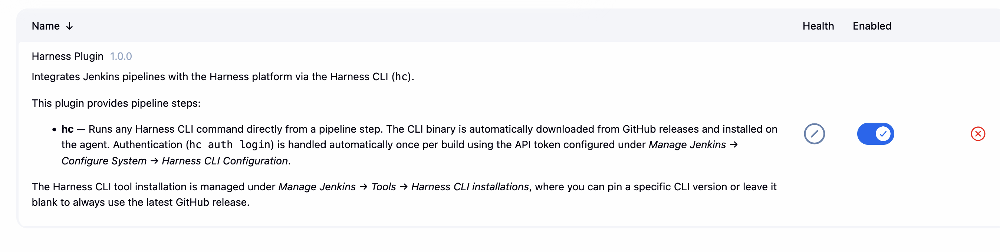
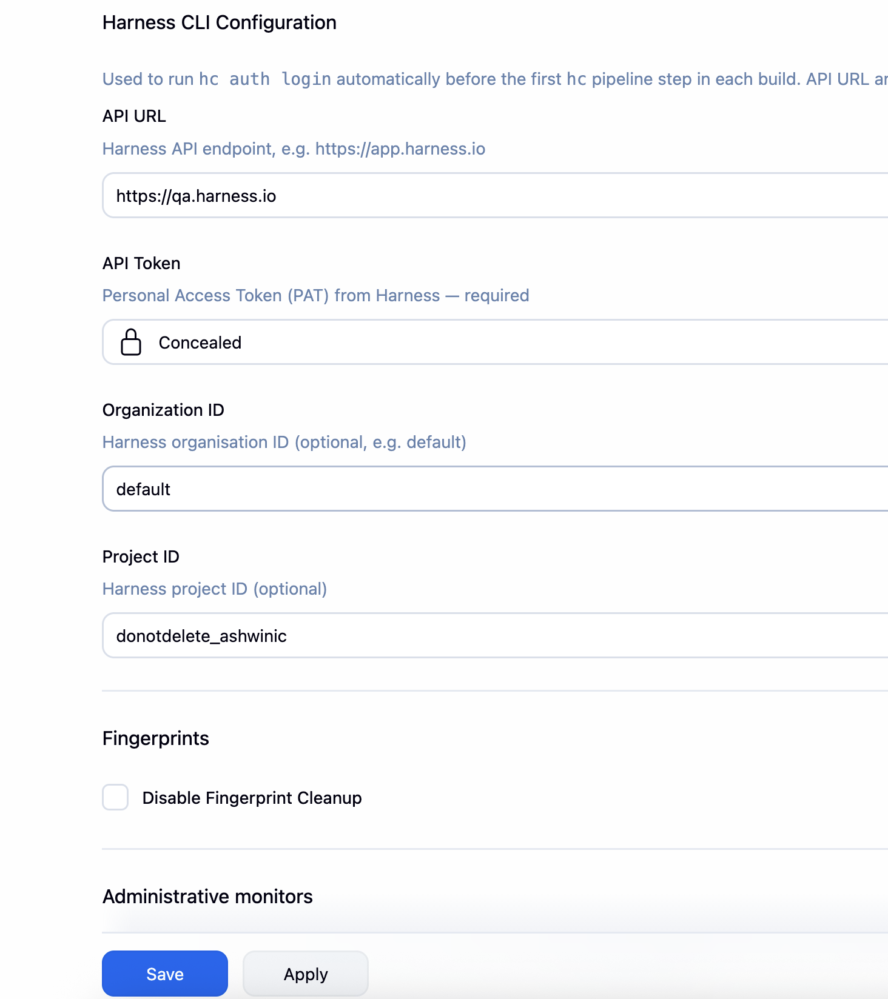
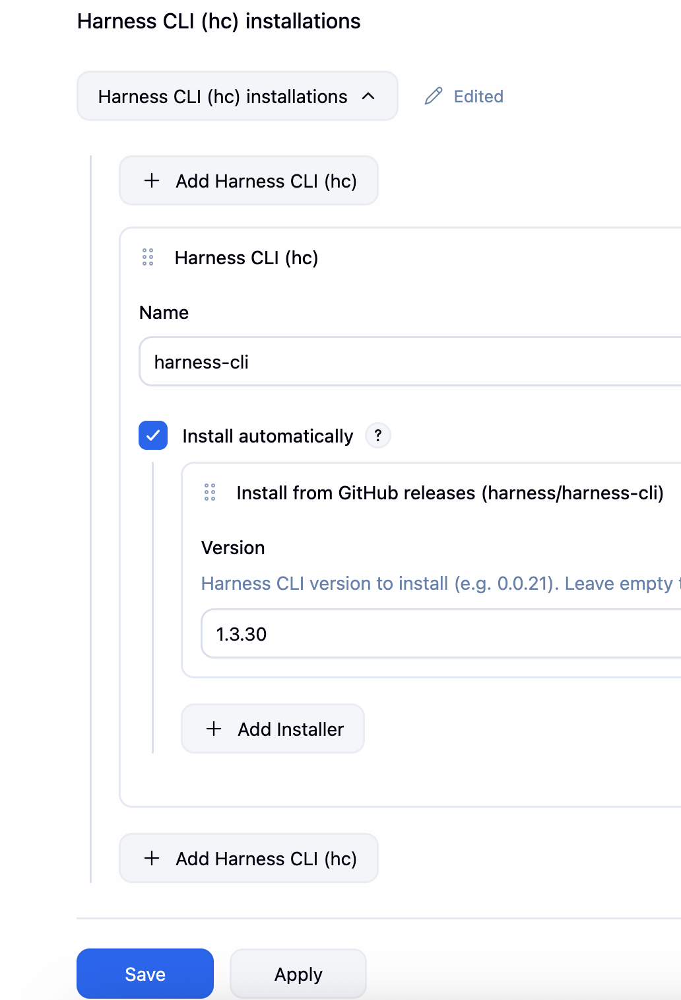
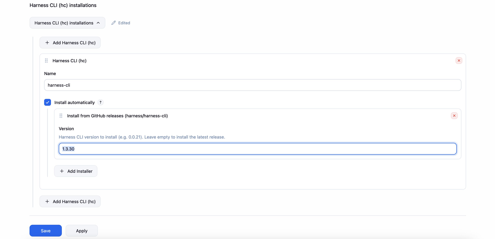
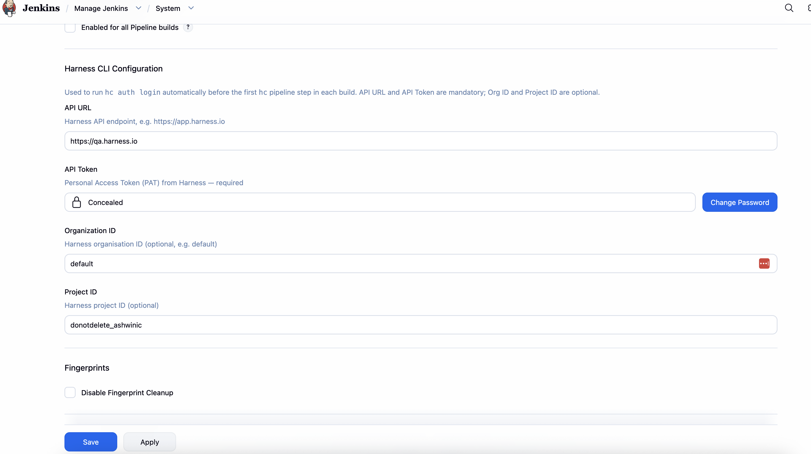
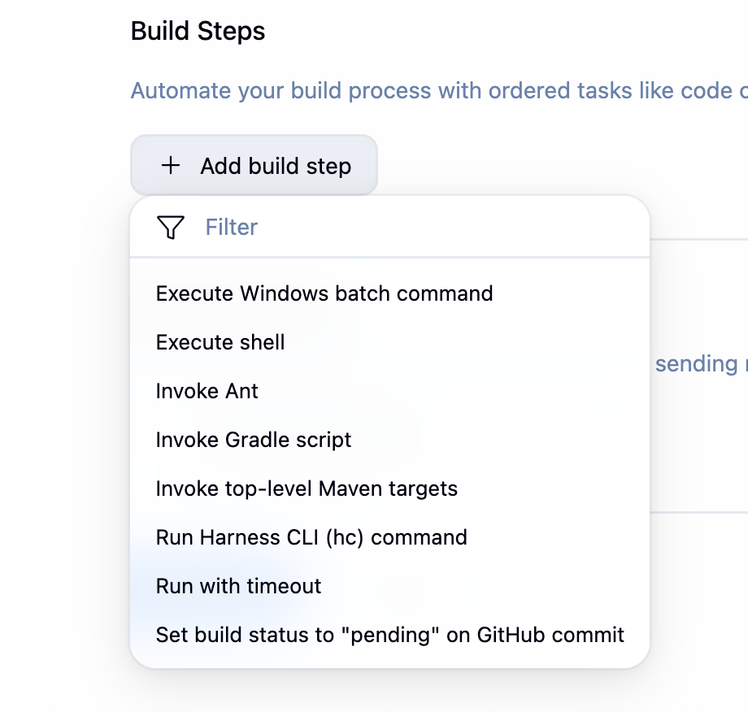
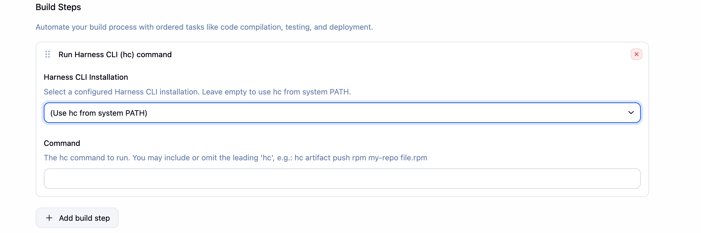

# Harness Jenkins Plugin

A Jenkins plugin that integrates the [Harness CLI (`hc`)](https://github.com/harness/harness-cli) into Jenkins pipelines and Freestyle jobs, enabling you to push artifacts to the Harness Artifact Registry directly from your CI builds.

---

## Install and configure the plugin

1. Install the Harness Plugin. Go to **Manage Jenkins** → **Plugins**.<br>
2. Configure your Harness CLI details. Go to **Manage Jenkins** → **System**.<br>
3. Configure Harness CLI as a tool in Jenkins. For more information, see [Configuring Harness CLI as a tool](#configuring-harness-cli-as-a-tool) section.

---

## Configure Harness CLI as a tool

To use Harness CLI in your pipeline jobs, configure it as a tool in Jenkins. Go to **Manage Jenkins** → **Tools**.


### Automatic installation from GitHub

If your agent has internet access, you can configure the installer to automatically download the Harness CLI
from [GitHub releases (harness/harness-cli)](https://github.com/harness/harness-cli/releases).




---

## Requirements

| Requirement | Details |
|---|---|
| Harness account | Any tier |
| Harness Personal Access Token (PAT) | Format: `pat.<AccountID>.<random>.<random>` |

---


## Usage

### Configure the Harness CLI tool installation

1. Go to **Manage Jenkins** → **Tools** and then navigate to **Harness CLI (hc) installations**.
2. Click **Add Harness CLI (hc)**. Provide a name (for example, `harness-cli`).
3. Enable **Install automatically**, and set the required **Version**. 

    The plugin downloads the binary from the [harness/harness-cli](https://github.com/harness/harness-cli/releases) GitHub releases automatically.



> Note: To always install the latest release, leave the version field empty.

---

### Configure Harness credentials

Go to **Manage Jenkins** → **System** and then navigate to **Harness CLI Configuration**.

| Field | Description |
|---|---|
| **API URL** | Harness API endpoint. For example, `https://app.harness.io`. |
| **API Token** | Personal Access Token (PAT) - stored as a Jenkins secret. |
| **Organization ID** | Optional. Your Harness Organization slug. For example, `default`. |
| **Project ID** | Optional. Your Harness Project slug. |



The plugin automatically runs `hc auth login` before the first `hc` step in every build and the API token is always masked in build logs.

---

### Use in a Freestyle job

1. In a Freestyle job configuration, go to **Build Steps** → **Add build step** and then select **Run Harness CLI (hc) command**.

    

    

2. Select the CLI installation (or leave as **Use hc from system PATH**) and type the `hc` command to run. 
You may include or omit the leading `hc`. For example: `artifact push rpm my-repo /path/to/file.rpm`.

    

---

## Pipeline Example

### Declarative Pipeline - push an artifact

```groovy
pipeline {
    agent any

    tools {
        harnessCli 'harness-cli'   // matches the name set in Manage Jenkins → Tools
    }

    stages {
        stage('Build') {
            steps {
                sh 'mvn clean package -DskipTests'
            }
        }

        stage('Push to Harness Artifact Registry') {
            steps {
                hc 'artifact push generic my-registry target/myapp-1.0.jar'
            }
        }
    }
}
```

### Declarative Pipeline - multiple artifact types

```groovy
pipeline {
    agent any

    tools { harnessCli 'harness-cli' }

    stages {
        stage('Push RPM') {
            steps {
                hc 'artifact push rpm rpm-repo dist/mypackage-1.0.x86_64.rpm'
            }
        }

        stage('Push Debian image') {
            steps {
                hc 'artifact push Debian Debian-repo myimage'
            }
        }
    }
}
```

### Scripted Pipeline

```groovy
node {
    tool name: 'harness-cli', type: 'io.jenkins.plugins.har.cli.HarnessCliInstallation'

    stage('Push') {
        hc 'artifact push generic my-registry build/output.zip'
    }
}
```

### Available `hc` commands (examples)

| Command | Description |
|---|---|
| `hc version` | Print installed CLI version |
| `hc auth status` | Check current login status |
| `hc artifact push generic <registry> <file>` | Push a generic artifact |
| `hc artifact push rpm <registry> <file.rpm>` | Push an RPM package |
| `hc artifact push Debian <registry> <image>` | Push a Debian image |

> Note: For the full command reference, see the [Harness CLI documentation](https://developer.harness.io/docs/platform/automation/cli/reference/).

---

## Contributing

Refer to [CONTRIBUTING.md](https://github.com/harness/harness/blob/main/CONTRIBUTING.md).

## License

Apache License 2.0. Refer [LICENSE](https://github.com/harness/harness/blob/main/LICENSE).